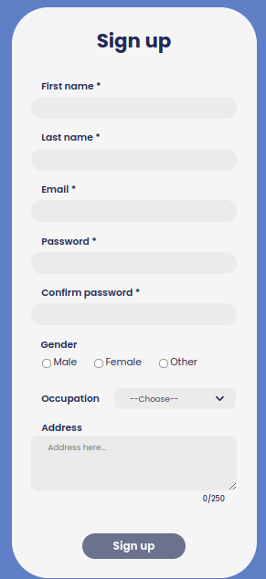
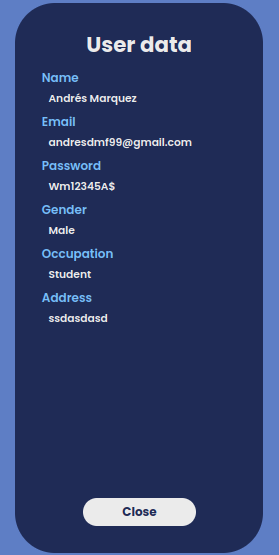

  

# Form - React.js

### Resume

This app shows a form with 8 input fields(4 required).It evauates each required input field,if all are correct it shows a green border in other cases are red,with a corresponding issue message.Finally,it shows an small card with a greeting and a button to show the data submitted in a big card.I used arrow functions, ternary operators, RegExp, validations and render props to share and validate value props between components.

### Stack used for this project

| Languages  | Libraries |
| ------------------------------ | ------------------------------ |
|   |   |
|   |   |
|   |   |

### Screenshoots of the app

